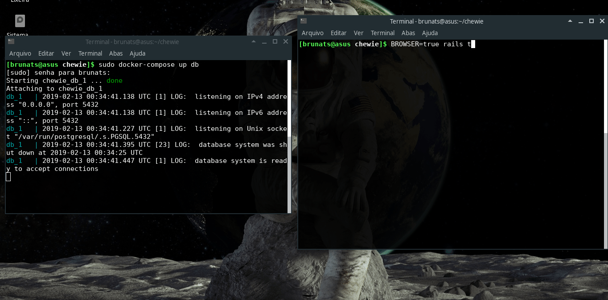

# Chewie Store

[](https://travis-ci.org/brunats/chewie)
[](https://coveralls.io/github/brunats/chewie?branch=master)

Essa aplicação implementa um CRUD de gerenciamento de pedidos JEDIS :shipit:. Ele gerencia produtos e clientes através de operações NxN dos seus pedidos.

Existem algumas regras:
 - Um pedido não pode conter produtos vendidos a preços abaixo de 10% do seu valor base.
 - Produtos vendidos acima do seu valor base são gratificados com uma carinha feliz :blush:.
 - Alguns produtos só podem ser vendidos em múltiplos.

## Env

Os ambientes são divididos em dev, staging e production.

### Dev
Esse projeto foi desenvolvido no Arch Linux. As dependências necessárias para esse sistema operacional são:

```
- rvm
- googlechrome-stable
- chrome-driver
- docker
- docker-compose
- nodejs
```

Todas essas dependências podem ser instaladas utilizando a ferramenta `pacman`. Em outros sistemas operacionais os nomes dos pacotes podem mudar.

### Staging

http://chewie.herokuapp.com/

### Production

TODO: ainda não temos, esperando o comércio com a Rebelião expandir pela galáxia.

## Setup

Nós usamos docker :tada:!

[](https://asciinema.org/a/9UmgPPEl6suJQ6Kov0VfXOdg7)

```sh
docker-compose up --build
```

Mas você também pode executar da forma tradicional...

```sh
cp config/database.example.yml config/database.yml
cp sample.env .env

bundle install
bundle exec rails db:create
bundle exec rails db:migrate
bundle exec rails db:seed
bundle exec rails s
```

## Test




```
docker-compose up db
BROWSER=TRUE rails t
```
